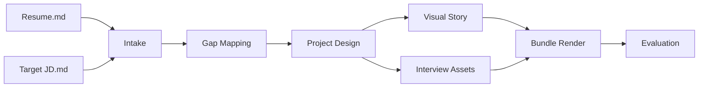

<div align="center">
  <h1>JD2Offer</h1>
  <p><strong>Turn a resume + target JD into a flagship project, visual story, and interview-ready case bundle.</strong></p>
  <p>一个面向 AI 求职准备的开源工具链：先拆岗位，再补知识，再设计主项目，最后把它变成能展示、能演讲、能评估的交付物。</p>
  <p>
    
    
    
    
    
  </p>
  <p>
    <a href="#what-is-jd2offer">What Is JD2Offer?</a> •
    <a href="#quick-start">Quick Start</a> •
    <a href="#what-you-get">What You Get</a> •
    <a href="#repo-architecture">Repo Architecture</a> •
    <a href="#faq">FAQ</a>
  </p>
</div>

## What Is JD2Offer?

> **Direct answer:** JD2Offer is an open-source resume-to-JD gap analysis and flagship project generator. It takes your resume and a target job description, identifies what the role really optimizes for, and produces a project spec, visual story, interview assets, and evaluation-ready output.

这个仓库不是单纯的“JD 解析器”，也不是单纯的“Agent demo”。

它把三件事连起来了：

1. `jd_offer`：把目标 JD 拆成结构化能力图谱、知识体系、资源包和项目蓝图。
2. `jd2offer_harness`：把“简历 + 目标 JD”放进一个分阶段 pipeline，产出 gap analysis、project spec、visual story、interview assets、final bundle 和 evaluation report。
3. `driverops_agent_lab`：提供一个可运行、可评测、可展示的旗舰项目样板，帮助你把“我会做什么”变成“我真的能演示什么”。

如果你只想快速看 JD 重点，用 `jd_offer`。
如果你想做一个真正围绕自己背景定制的主项目，用 `jd2offer_harness`。
如果你还想把项目跑起来、讲评测闭环，再接 `driverops_agent_lab`。

## Why This Repo Exists

大多数求职工具只能做到其中一步：

- 只会改简历措辞
- 只会提取 JD 关键词
- 只会给一堆零散项目建议
- 只会生成一些“看起来像 AI 写的”泛化素材

JD2Offer 的目标不是这些。

它要解决的是更完整的一条链路：

1. 这个岗位真正重视哪些能力？
2. 我当前简历里已经有什么，缺什么？
3. 我该做哪一个主项目，才最能证明自己匹配？
4. 这个项目该怎么可视化、可讲述、可评估？

换句话说，JD2Offer 想做的是 **career engineering**，不是单点文案优化。

## What You Get

| Input | Core Output | Why It Matters |
| --- | --- | --- |
| Resume Markdown | `resume_evidence.yaml` | 把你真实经历先结构化，避免后面项目设计脱离本人背景。 |
| Target JD Markdown | `gap_analysis.yaml` | 明确“已匹配能力”和“需要项目补足的缺口”。 |
| Project Archetype + Rules | `project_spec.yaml` | 生成一个主线统一、足够可信的旗舰项目方案。 |
| Project Spec | `visual_story.yaml` | 产出 Mermaid 架构图、demo flow、talking points。 |
| Project Spec | `interview_assets.yaml` | 产出简历 bullet、3 分钟讲稿、10 分钟讲解提纲。 |
| All Stage Artifacts | `final_case_bundle.md` | 把项目设计、图、讲稿汇总成一份最终交付物。 |
| Final Bundle + Rubrics | `evaluation_report.yaml` | 让输出不只是“看起来不错”，而是可评分、可迭代。 |

## Why It Feels Different

| Dimension | Generic JD Parser | JD2Offer |
| --- | --- | --- |
| Input grounding | 只看 JD | 同时看 `resume + target JD` |
| Project suggestion | 常常是多个零散 demo | 默认收敛到一个旗舰项目 |
| Visual output | 很少有 | 有 visual story、Mermaid 图、demo flow |
| Interview prep | 多半是泛泛问答 | 直接产出简历 bullet、pitch、讲解提纲 |
| Evaluation | 通常没有 | 有 rubric 和 `evaluation_report.yaml` |
| Runnable evidence | 往往停在文案 | 可接 `driverops_agent_lab` 做可运行样板 |

## Pipeline



当前已落地的 harness 主链路：

- `intake`
- `gap-mapping`
- `project-design`
- `visual-story`
- `interview-assets`
- `bundle-render`
- `evaluation`

## Quick Start

### Option A: Harness-First Workflow

如果你要的是“根据我的简历 + 目标 JD 生成主项目”，这条链最适合。

```bash
PYTHONPATH=src python -m jd2offer_harness.cli init-case \
  --resume /path/to/your_resume.md \
  --jd examples/didi_2026_agent_jd.md \
  --company didi \
  --role agent-algorithm \
  --outdir cases/didi-agent-2026-harness
```

然后按阶段执行：

```bash
for stage in intake gap-mapping project-design visual-story interview-assets bundle-render evaluation; do
  PYTHONPATH=src python -m jd2offer_harness.cli run-stage \
    --workspace cases/didi-agent-2026-harness \
    --stage "$stage"
done
```

最终你会得到：

- `stages/01-intake/resume_evidence.yaml`
- `stages/03-gap-mapping/gap_analysis.yaml`
- `stages/04-project-design/project_spec.yaml`
- `stages/05-visual-story/visual_story.yaml`
- `stages/06-interview-assets/interview_assets.yaml`
- `outputs/final_case_bundle.md`
- `stages/08-evaluation/evaluation_report.yaml`

### Option B: Classic Deterministic Bundle

如果你只想先把 JD 理顺，可以继续用现有 `jd_offer` CLI。

```bash
PYTHONPATH=src python -m jd_offer.cli generate \
  --input examples/didi_2026_agent_jd.md \
  --company didi \
  --role agent-algorithm \
  --resource-overrides examples/didi_2026_verified_resources.yaml \
  --outdir cases/didi-agent-2026
```

### Option C: Run the Flagship Demo Project

如果你想把“主项目”落成一个可运行样板，可以启动 `DriverOps Agent Lab`：

```bash
PYTHONPATH=src python -m driverops_agent_lab.cli serve
```

打开：

- Demo: `http://127.0.0.1:8001/demo`
- API: `http://127.0.0.1:8001/chat`

## What You Can Show In A Demo

`driverops_agent_lab` 当前能展示：

- intent classification
- planner / executor style multi-step flow
- grounded answer with evidence
- short-term memory and lightweight long-term memory
- offline evaluation snapshots
- training sample export
- failure review export

这意味着 README 里的“主项目”不是纯概念图，而是可以延伸到一套真实可运行演示。

## Repo Architecture

| Layer | Path | Responsibility |
| --- | --- | --- |
| Harness-first pipeline | `src/jd2offer_harness/` | 基于 `resume + JD` 的 stage runner，负责 gap、project、visual、bundle、evaluation |
| Deterministic generator | `src/jd_offer/` | 传统 JD -> bundle 链路，适合快速结构化拆解 |
| Runnable flagship sample | `src/driverops_agent_lab/` | 可运行样板项目，承接 Agent、memory、evaluation、training loop |
| Knowledge and rules | `configs/`, `prompts/` | taxonomy、project archetypes、evaluation rubrics、prompt templates |
| Examples and outputs | `examples/`, `cases/`, `docs/examples/` | 样例 JD、资源覆盖、case bundle、手工整理的讲解文档 |
| Implementation plans | `docs/plans/` | 设计和重构计划，帮助后续 AI / 人类协作开发 |

## Output Files That Matter

### Harness Outputs

| File | Meaning |
| --- | --- |
| `resume_evidence.yaml` | 你的真实经历和技能证据 |
| `gap_analysis.yaml` | 已匹配信号与待补强信号 |
| `project_spec.yaml` | 旗舰项目方案、模块、stretch areas |
| `visual_story.yaml` | 架构图、demo flow、talking points |
| `interview_assets.yaml` | 简历 bullet、3 分钟 pitch、10 分钟提纲 |
| `final_case_bundle.md` | 汇总后的最终交付文档 |
| `evaluation_report.yaml` | 基于 rubric 的打分和 readiness 判断 |

### Classic `jd_offer` Outputs

| File | Meaning |
| --- | --- |
| `01_jd_decomposition.md` | JD 结构化拆解 |
| `02_knowledge_system.md` | 学习路径与知识树 |
| `03_resource_pack.md` | 资源包 |
| `04_project_blueprint.md` | 项目蓝图 |
| `05_interview_assets.md` | 简历与面试素材 |
| `manifest.yaml` | 生成元数据 |

## Example Resources

- JD input: [`examples/didi_2026_agent_jd.md`](examples/didi_2026_agent_jd.md)
- Verified resource overrides: [`examples/didi_2026_verified_resources.yaml`](examples/didi_2026_verified_resources.yaml)
- Deterministic case bundle: [`cases/didi-agent-2026/`](cases/didi-agent-2026)
- DriverOps project note: [`docs/examples/2026-03-09-driverops-agent-lab.md`](docs/examples/2026-03-09-driverops-agent-lab.md)
- JD blueprint note: [`docs/examples/2026-03-09-didi-agent-jd-blueprint.md`](docs/examples/2026-03-09-didi-agent-jd-blueprint.md)
- Harness refactor plan: [`docs/plans/2026-03-24-jd2offer-harness-refactor.md`](docs/plans/2026-03-24-jd2offer-harness-refactor.md)

## Who This Is For

- 想从“会一些技术”升级到“能围绕目标岗位设计主项目”的候选人
- 想把简历背景和目标 JD 串成一个统一故事的人
- 想做 AI / Agent / 平台 / 后端 / 评测类岗位准备的人
- 想把一个项目讲成“能展示、能追问、能评估”的候选人

## FAQ

### What problem does JD2Offer solve?

它解决的是“岗位要求很多、个人经历很散、项目建议太泛”这三个问题叠在一起时的求职准备难题。它不是只改文案，而是帮你把 **resume、JD、project、visual story、interview delivery** 串成一条线。

### Does JD2Offer only parse job descriptions?

不是。

- `jd_offer` 主要处理 JD
- `jd2offer_harness` 主要处理 `resume + JD`
- `driverops_agent_lab` 提供可运行样板项目

### Why one flagship project instead of many small demos?

因为面试最吃香的是“主线统一、可信度高、可追问”的项目，而不是 5 个互相无关的小 demo。一个项目如果同时覆盖能力缺口、视觉展示和讲解主线，价值通常更高。

### Is DriverOps Agent Lab the only project family?

不是。

它是仓库里当前最成熟的参考样板。`jd2offer_harness` 已经开始引入 `project_archetypes`，目标是支持不止一种项目 family，而不是把所有 JD 都塞进一个模板。

### What does the evaluation report measure?

当前 rubric 包括：

- `resume_grounding_score`
- `jd_coverage_score`
- `project_coherence_score`
- `visual_completeness_score`
- `presentation_readiness_score`

这使得输出更接近可迭代的设计工件，而不是一次性生成的文案。

## Current Status

- `jd_offer`：稳定，可用于经典 JD -> bundle 生成
- `jd2offer_harness`：已打通从 `intake` 到 `evaluation` 的最小主链路
- `driverops_agent_lab`：稳定，可做可运行主项目样板

## Validation

```bash
PYTHONPATH=src pytest -q
```

你也可以分别验证：

```bash
PYTHONPATH=src python -m jd_offer.cli --help
PYTHONPATH=src python -m jd2offer_harness.cli --help
PYTHONPATH=src python -m driverops_agent_lab.cli --help
```

