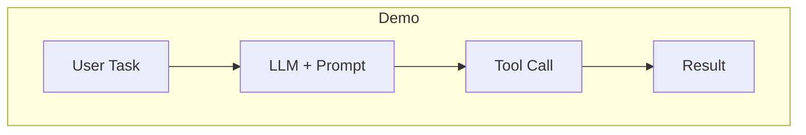
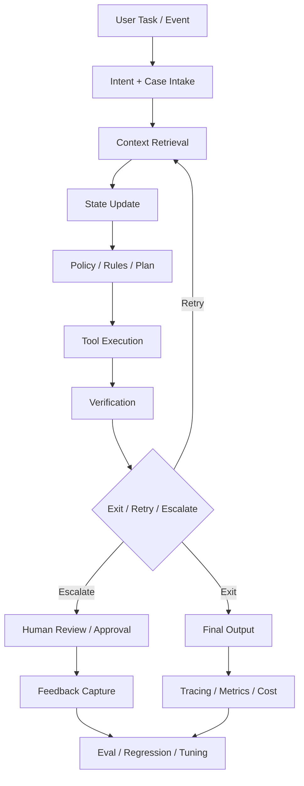
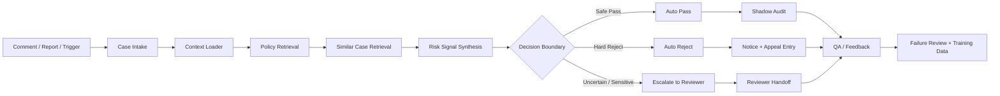
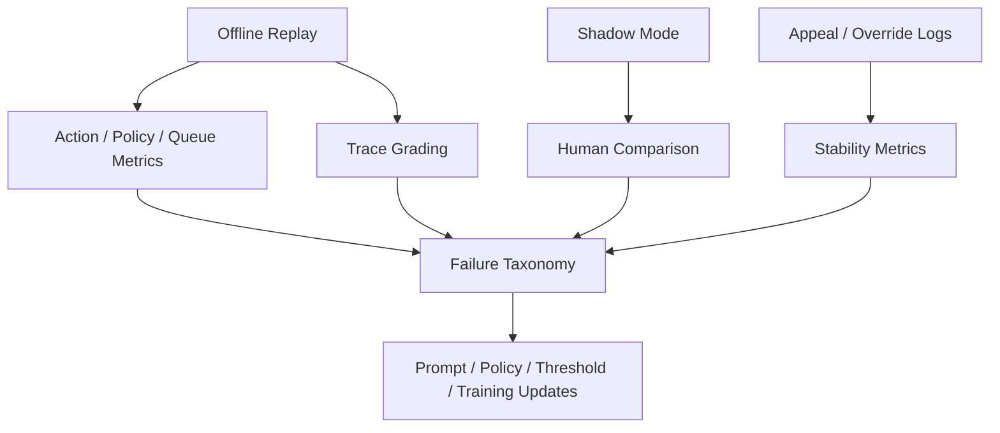

# Agent 工程化 vs Demo，以及评论审核 Agent 的关键注意事项

## 说明

你给的微信文章链接 `https://mp.weixin.qq.com/s/Axis4fTMkxzAkeorDFHd2A` 在当前环境下触发了微信的人机验证页，无法直接完整抓取正文。

因此，这份分析采用两步法：

1. 以你提出的两个核心问题为主线，提炼文章大概率关注的主命题：
   - Agent 的工程化与 demo 的差别
   - 评论审核 Agent 该怎么落地
2. 用高质量、官方或一手资料对这些命题做交叉验证，避免把结论建立在模糊印象上。

换句话说，这份文档不是“逐句复述微信原文”，而是“围绕原文主题做经过一手资料校正的工程化分析”。

## 结论先行

如果你只记住两句话，记这两句：

1. `Demo 的重点是“跑通一次”，工程化 Agent 的重点是“长期稳定、可控、可回放、可评测、可迭代”。`
2. `评论审核 Agent 的重点不是“模型判得准不准”，而是“证据是否充分、边界是否安全、人审是否顺畅、申诉和失败是否能进入闭环”。`

---

## 第一部分：从整体 Agent 思路看，工程化和 Demo 的本质区别

## 1. Demo 在证明什么，工程化在证明什么

### Demo 的目标

Demo 通常在证明：

- 这个问题“理论上能不能做”
- 模型“在几个样例上能不能表现得不错”
- 工具调用“能不能串起来”
- 用户看起来“是否有 wow moment”

所以 demo 常见特点是：

- 样例少
- 路径固定
- 异常场景少
- 人工挑选案例
- 不重视长期稳定性
- 不重视观测和回归

### 工程化 Agent 的目标

工程化在证明：

- 这个系统能否持续运行
- 在波动环境下是否还能稳定表现
- 成本、时延、成功率、风险是否可控
- 出错后是否可定位、可回放、可修复
- 每一次升级是否能被评测和验证

Anthropic 在 2024 年 12 月 19 日的官方文章里明确区分了：

- `workflow`：通过预定义代码路径编排 LLM 和工具
- `agent`：由模型动态决定过程和工具使用

同时它强调：

- 先找最简单可行方案
- 只有在必要时才增加 agentic complexity
- workflow 更适合可预测、可控任务
- agents 更适合步骤数难以预先写死的开放任务

来源：

- Anthropic, Dec 19, 2024
  [Building effective agents](https://www.anthropic.com/research/building-effective-agents/)

这其实已经说明：

`demo` 和 `工程化` 的差别，不是“有没有用 agent framework”，而是“你是在做一次性演示，还是在做可长期演化的 workflow system”。`

## 2. 用一张图看清 Demo 和工程化的差别

上面这张图是很多 demo 的真实结构：

- 用户给任务
- 模型理解
- 调一个工具
- 看起来出了结果

而工程化 Agent 更像下面这样：

这张图里多出来的东西，几乎就是“工程化”的全部。

---

## 3. 工程化 Agent 必须补齐的八个能力

## 3.1 明确的状态模型

Demo 往往只有 prompt。

工程化 Agent 必须先有 `state`。

为什么？

因为真正的 Agent 不是“一次回答”，而是一段过程。

至少要回答：

- 当前任务是什么
- 已收集到哪些上下文
- 已调用过哪些工具
- 哪些结果已确认
- 现在处于哪个阶段
- 退出条件是什么

OpenAI 在官方 Agent Builder 文档里直接把 agent 定义为 `workflow` 的构建过程；LangGraph 则把重点放在 `state graph`、durable execution、human-in-the-loop、streaming 上。

来源：

- OpenAI Agent Builder
  [Agent Builder](https://platform.openai.com/docs/guides/agent-builder)
- LangGraph overview
  [LangGraph overview](https://docs.langchain.com/oss/python/langgraph/overview)

### 必须做

- 明确定义 state schema
- 每个 node 的输入输出契约固定
- 用状态驱动流程，而不是靠 prompt 隐式记忆

### 不做会怎样

- 很难回放
- 很难恢复执行
- 很难定位错在哪一步
- 很难做人审打断和恢复

## 3.2 清晰、可控的工具契约

Demo 里，工具常常只是“函数能调就行”。

工程化里，工具是 Agent 的行为边界。

Anthropic 在 2025 年 9 月 11 日的官方工程文章明确强调：

- Agents are only as effective as the tools we give them
- 好工具要有清晰边界
- 要返回对 agent 真正有意义的上下文
- 要考虑 token efficiency
- tool description 和 spec 需要像 prompt 一样认真工程化
- 参数命名必须无歧义

来源：

- Anthropic, Sep 11, 2025
  [Writing effective tools for agents](https://www.anthropic.com/engineering/writing-tools-for-agents)

### 必须做

- 工具名和职责不要重叠
- 参数名必须可读、无歧义
- 输入输出要严格 schema 化
- 给出边界、失败条件、示例
- 返回结果要“足够行动”，不是只返回一大坨原始数据

### 重点做

- tool docs 当成 prompt 来优化
- 高风险工具打标签
- destructive actions 需要审批或中断

### 不做会怎样

- agent 选错工具
- 参数传错
- 拿到结果也不会用
- 多工具之间互相污染职责

## 3.3 可恢复执行与中断点

Demo 失败了就重跑。

工程化 Agent 必须能：

- 暂停
- 恢复
- 从最近 checkpoint 继续

LangGraph 的官方文档把这点说得非常直接：

- durable execution 支持 pause/resume
- 支持从最后成功 checkpoint 恢复
- human-in-the-loop 时可以 interrupt，再用 command resume

来源：

- LangGraph durable execution
  [Durable execution](https://docs.langchain.com/oss/python/langgraph/durable-execution)
- LangGraph HITL
  [Human-in-the-loop](https://docs.langchain.com/oss/javascript/langchain/human-in-the-loop)

### 必须做

- 长链路任务有 checkpoint
- 中断后状态可恢复
- 失败恢复逻辑明确

### 适合做中断的地方

- 高风险工具调用前
- 资金/删除/封禁等不可逆动作前
- 证据不足时
- 需要人工补充信息时

## 3.4 验证回路，而不是只生成结果

很多 demo 到“生成结果”就结束了。

工程化 Agent 必须有 `verify loop`。

Anthropic 在 Claude Agent SDK 的工程文章里把 agent loop 概括为：

`gather context -> take action -> verify work -> repeat`

来源：

- Anthropic
  [Building agents with the Claude Agent SDK](https://www.anthropic.com/engineering/building-agents-with-the-claude-agent-sdk/)

### 必须做

- 每次重要行动后要校验
- 校验可以是规则、执行结果、截图、审计规则、二次评判
- 失败后要么重试，要么升级，要么退出

### 常见验证方式

- rules-based checks
- executable checks
- schema validation
- postcondition checks
- secondary grader / judge
- human approval

### 不做会怎样

- 错误会一路放大
- 工具执行失败也可能被包装成“成功”
- final answer 看起来流畅但业务上无效

## 3.5 Guardrails 与权限分层

Demo 的 guardrail 常常只是“加一句请安全回答”。

工程化 Agent 的 guardrail 是多层的。

OpenAI 在实践指南里强调：

- guardrails 要分层
- 可以结合 LLM-based guardrails、rules-based guardrails、moderation API
- 高风险动作应触发 human oversight

来源：

- OpenAI
  [A practical guide to building AI agents](https://openai.com/business/guides-and-resources/a-practical-guide-to-building-ai-agents/)

### 必须做

- 输入安全检查
- 工具调用安全检查
- 输出安全检查
- 高风险操作审批
- 最大步数、预算、超时限制

### 高风险动作例子

- 删除数据
- 发钱/退款
- 封号/处罚
- 对外发送正式结论

## 3.6 可观测性与 Trace

Demo 的调试方式往往是“看控制台输出”。

工程化 Agent 需要 `trace`。

OpenAI 的 Agent evals 明确建议：

- 用 reproducible evaluations 测质量
- workflow-level error 用 trace grading 去定位

来源：

- OpenAI
  [Agent evals](https://developers.openai.com/api/docs/guides/agent-evals)

### 必须做

- 每步调用都记录 trace
- 记录 tool name、arguments、result summary、latency、cost、error
- 记录 final action 与 exit reason

### 重点做

- 让 trace 能映射到业务阶段
- 能基于 trace 做 failure taxonomy

### 不做会怎样

- 你只能知道“结果错了”
- 但不知道错在取证、决策、路由还是执行

## 3.7 Eval 与回归，而不是“看体验”

Demo 的验证方式常常是：

- 我试了几个问题，感觉不错

工程化 Agent 不能这样。

OpenAI 的 eval best practices 和 model optimization 指南强调：

- 先定义 eval objective
- 数据集应来自 production data、domain-specific data、historical data
- 每次改动都要 continuous evaluation
- LLM 更适合做 pairwise comparison、classification、criteria-based grading
- 优化是 eval、prompt、fine-tuning 的 feedback flywheel

来源：

- OpenAI
  [Evaluation best practices](https://developers.openai.com/api/docs/guides/evaluation-best-practices)
- OpenAI
  [Model optimization](https://developers.openai.com/api/docs/guides/model-optimization)

### 必须做

- 有版本化 eval set
- 有 regression suite
- 每次 prompt/tool/policy 变化都回归

### 重点做

- trace-level grading
- slice-level evaluation
- hard case set

## 3.8 渐进式复杂化，而不是一开始就多智能体

这是最常见误区。

OpenAI 实践指南和 Anthropic 官方文章都在强调同一件事：

- 先把单 Agent 做强
- 只有在复杂度确实需要时才拆多 Agent

OpenAI 说得很明确：

- customers 通常在 incremental approach 上成功率更高
- 先 single-agent，再视情况发展 multi-agent

Anthropic 也明确说：

- find the simplest solution possible
- only increase complexity when needed

来源：

- OpenAI
  [A practical guide to building AI agents](https://openai.com/business/guides-and-resources/a-practical-guide-to-building-ai-agents/)
- Anthropic
  [Building effective agents](https://www.anthropic.com/research/building-effective-agents/)

### 必须做

- 先证明单 Agent + tools 不够
- 再证明 workflow 需要多 specialization
- 再决定是否 multi-agent

### 不建议一开始就做

- agent network
- swarm
- 动态生成 agent
- 复杂自治协作

---

## 4. Demo 和工程化的差别，用表看最清楚

| 维度 | Demo | 工程化 Agent |
|---|---|---|
| 目标 | 跑通、展示可能性 | 稳定上线、长期运行 |
| 数据 | 少量精选样例 | 生产分布、历史数据、难例切片 |
| 流程 | 一条 happy path | 有重试、异常、升级、恢复 |
| 工具 | 能调用即可 | 有契约、边界、权限、评测 |
| 状态 | 多靠 prompt 隐含 | 显式 state schema |
| 安全 | 轻量提示约束 | 分层 guardrails + HITL |
| 观测 | 控制台输出 | trace、metrics、cost、latency |
| 评测 | 主观体验 | regression + slice eval + trace grading |
| 升级 | 改 prompt 看效果 | 版本化变更 + 回归对比 |
| 人工 | 很少考虑 | 明确审批、接管、反馈回流 |

---

## 5. 如果你要做工程化 Agent，哪些是“必须做”

### 第一优先级：一定要有

- 明确 state schema
- 明确 tool contracts
- 明确 exit conditions
- 有 guardrails
- 有 human escalation
- 有 trace
- 有 regression eval

### 第二优先级：强烈建议尽快补齐

- checkpoint / resume
- failure taxonomy
- slice-based eval
- rollout / shadow mode
- cost / latency dashboard

### 第三优先级：在基础稳定后再做

- multi-agent
- 自动 prompt 优化
- 复杂 memory
- RL / DPO / reward pipelines

---

## 第二部分：回到评论审核 Agent，应该注意哪些

## 6. 为什么评论审核 Agent 比一般 Agent 更难

评论审核不是“帮助用户找信息”。

它是高约束、高风险、高审计要求的业务。

因为它天然要同时处理：

- 安全风险
- 误杀风险
- 人审协作
- 申诉与翻案
- 一致性
- 规则频繁更新

这决定了评论审核 Agent 不能只做成一个“会判标签的模型外壳”。

它更像一个：

`case processing system`

## 7. 评论审核 Agent 的核心任务，不是分类，而是边界控制

### 最关键的业务问题不是：

- 这条评论像不像违规

### 而是：

- 哪些 case 可以安全自动通过
- 哪些 case 可以自动拒绝
- 哪些 case 必须交给人工
- 自动决定背后的依据是什么
- 如何把 reviewer override 和 appeal 变成下轮优化数据

所以评论审核 Agent 的核心不是“分类器”，而是：

`evidence + decision boundary + routing + learning flywheel`

## 8. 一张图看清评论审核 Agent 的正确形态

这张图里每个节点都很重要。

### 不能省的节点

- `Case Intake`
- `Context Loader`
- `Policy Retrieval`
- `Risk Signal Synthesis`
- `Decision Boundary`
- `Reviewer Handoff`
- `Feedback Capture`

### 很容易被 demo 忽略，但工程上必须要有

- `Appeal Entry`
- `Shadow Audit`
- `Failure Review`
- `Training Data Flow`

---

## 9. 评论审核 Agent 必须重点注意的十件事

## 9.1 审核对象必须是 case，不是裸文本

本地项目里这一点已经做对了。

[agent.py](/Volumes/passport/简历/滴滴/src/commentops_agent_lab/agent.py#L28) 的 `run()` 已经把这些字段纳入决策：

- `comment_text`
- `thread_context`
- `reporter_count`
- `prior_violation_count`
- `prior_appeal_overturns`
- `author_tenure_days`
- `policy_version`

这比裸文本分类更接近真实审核系统。

### 必须做

- case schema 明确化
- 上下文、历史风险、举报、申诉等字段结构化

### 不做会怎样

- 误杀阴阳怪气/引用/反讽类内容
- 忽视历史高风险账号和举报聚集风险

## 9.2 必须 policy-grounded，不能黑箱判

评论审核是规则强约束场景。

TikTok Enforcement 页面明确体现了：

- automated review
- additional review
- notice
- appeal

YouTube 官方也长期强调：

- policy lines
- appeals
- consistency and quality review

来源：

- TikTok
  [Community Guidelines Enforcement](https://www.tiktok.com/community-guidelines/en/enforcement)
- YouTube
  [Policy development at YouTube](https://blog.youtube/inside-youtube/policy-development-at-youtube/)

### 必须做

- 每个 action 关联 policy clause
- reviewer 能看见命中的 policy
- 申诉时能回看 policy 依据

### 本地项目对应

[schemas.py](/Volumes/passport/简历/滴滴/src/commentops_agent_lab/schemas.py#L77) 和 [agent.py](/Volumes/passport/简历/滴滴/src/commentops_agent_lab/agent.py#L131) 已经有 `policy_clause_ids`、`matched_policies` 和 policy hit 逻辑，但当前还是关键词级，距离真正 retrieval + grounding 还有差距。

## 9.3 自动化边界必须是三态，而不是二分类

本地项目这点也做对了。

[agent.py](/Volumes/passport/简历/滴滴/src/commentops_agent_lab/agent.py#L256) 的决策是：

- `reject`
- `escalate`
- `pass`

这很关键。

因为 TikTok、Meta、YouTube 的公开实践都说明：

- 自动检测和人工追加审核是并存的
- 高影响决策和争议样本不能只靠模型一锤定音

来源：

- TikTok
  [Community Guidelines Enforcement](https://www.tiktok.com/community-guidelines/en/enforcement)
- Meta, Mar 20, 2026
  [Boosting Your Support and Safety on Meta’s Apps With AI](https://about.fb.com/news/2026/03/boosting-your-support-and-safety-on-metas-apps-with-ai/)

### 必须做

- `safe pass zone`
- `hard reject zone`
- `human review zone`

### 不做会怎样

- 要么误杀高
- 要么漏放高
- 要么 reviewer 被边缘化

## 9.4 reviewer handoff 必须是产品功能，不是失败兜底

很多审核 demo 的思路是：

- 先自动判
- 判不出来就让人看

这太粗。

真正工程化的评论审核 Agent 需要回答：

- 升级人工的原因是什么
- reviewer 接手时看什么
- 哪个 queue
- 什么 priority
- SLA 多久

本地项目在这点上已经有雏形：

- `queue_routing`
- `business_impact`
- `review_notes`
- `recommended_actions`

对应代码：

- [agent.py](/Volumes/passport/简历/滴滴/src/commentops_agent_lab/agent.py#L96)
- [agent.py](/Volumes/passport/简历/滴滴/src/commentops_agent_lab/agent.py#L290)

### 必须做

- handoff note 结构化
- queue routing 明确
- reviewer 证据就绪率可评测

## 9.5 申诉与翻案不是边缘环节，而是主闭环入口

Meta 官方明确说：

- appeals 等高影响决策仍需人工关键角色

YouTube 官方长期跟踪：

- appeals
- reinstatements

来源：

- Meta
  [Boosting Your Support and Safety on Meta’s Apps With AI](https://about.fb.com/news/2026/03/boosting-your-support-and-safety-on-metas-apps-with-ai/)
- YouTube
  [Policy development at YouTube](https://blog.youtube/inside-youtube/policy-development-at-youtube/)

### 必须做

- 记录 appeal outcome
- 记录 reviewer override
- 把 overturn case 单独纳入 regression set

### 不做会怎样

- 误杀问题长期不可见
- 系统会越来越自信地犯同类错

## 9.6 不能只看 accuracy，要看 exposure 与 harm

YouTube 把 `Violative View Rate` 当作核心责任指标，不只是 removal accuracy。

来源：

- YouTube, Apr 6, 2021
  [Building greater transparency and accountability with the Violative View Rate](https://blog.youtube/inside-youtube/building-greater-transparency-and-accountability/)

换到评论审核场景，意味着你要关心：

- 高危漏放暴露率
- 热门帖子下违规评论暴露率
- 被举报后到被处置的停留时间

### 必须做

- 给 case 加 `reach / popularity / exposure risk`
- 高曝光 case 提高优先级

### 不做会怎样

- 你可能整体 accuracy 很高
- 但真正高影响内容仍然在扩散

## 9.7 基础 detector score 只能做信号层，不能直接做最终 action

Perspective API 的官方说法很清楚：

- moderation easier
- not replace human decision-makers

OpenAI moderation guide 也明确说：

- `category_scores` 是每类的模型置信度
- 依赖它们的 custom policy 可能需要持续 recalibration

来源：

- Google
  [Perspective API Codelab](https://developers.google.com/codelabs/setup-perspective-api)
- OpenAI
  [Moderation guide](https://developers.openai.com/api/docs/guides/moderation)

### 必须做

- `base score -> policy grounding -> decision boundary`

### 不建议做

- 单阈值直接删帖/封禁/拒绝

## 9.8 评论审核 Agent 的 eval 必须分层

本地项目现在的离线评测是一个正确起点，但太小。

[eval.py](/Volumes/passport/简历/滴滴/src/commentops_agent_lab/eval.py#L28) 目前覆盖：

- `action_accuracy`
- `policy_grounding_rate`
- `escalation_precision`
- `human_review_rate`
- `queue_routing_accuracy`

这很好，但工程化版本还需要继续扩展。

### 至少应增加

- `high_risk_recall`
- `over_enforcement_proxy`
- `under_enforcement_proxy`
- `appeal_overturn_rate`
- `reviewer_override_rate`
- `evidence_ready_rate`
- `policy_version_regression_rate`
- `consistency_on_similar_cases`

### 推荐的评测分层

## 9.9 failure taxonomy 必须先于训练

本地项目已经有这层雏形：

[training_data.py](/Volumes/passport/简历/滴滴/src/commentops_agent_lab/training_data.py#L133) 里已经把部分失败归成：

- `queue_mismatch`
- `manual_review_pressure`
- `shadow_audit_candidate`
- `appeal_sensitive`

这方向是对的，但生产里需要更细：

- missing context
- weak policy grounding
- wrong queue
- over-enforcement
- under-enforcement
- bad escalation boundary
- inconsistent adjudication

### 必须做

- 错误先归因
- 再决定修什么

### 顺序应该是

- 修 evidence
- 修 policy
- 修 threshold / routing
- 最后再看是否进入 SFT / preference / reward

## 9.10 评论审核 Agent 一开始不该追求“全自动”

TikTok、Meta、YouTube 的官方公开信号都在说明：

- 自动化很重要
- 但人工协同、追加审核、申诉与透明度同样重要

所以最成熟的目标不是：

- `full automation`

而是：

- `safe automation boundary`

这句话很重要，面试时也非常好用。

---

## 10. 评论审核 Agent：哪些是重点要做、必须做

### 第一优先级：必须做

- case schema
- policy grounding
- 三态边界 `pass / reject / escalate`
- queue routing
- reviewer handoff
- appeal / override logging
- regression evals
- trace + failure review

### 第二优先级：重点做

- similar case retrieval
- shadow audit
- exposure-aware prioritization
- policy version regression
- appeal-sensitive slices

### 第三优先级：后续升级

- richer memory
- better retrieval
- preference / reward pipeline
- LangGraph durable execution
- multi-agent specialization

### 不建议过早做

- 炫技式 multi-agent
- 复杂 UI 先行
- 直接上 RL
- 把审核系统定位成“全自动审查”

---

## 11. 如果你在面试里讲这件事，推荐这样表达

### 工程化 Agent vs Demo

`我理解 demo 更多是在证明这个问题能不能跑通，而工程化 Agent 要解决的是长期稳定性、可控性、可恢复性、可评测性和可迭代性。真正的工程化重点不是框架有多复杂，而是有没有显式状态、工具契约、guardrails、human-in-the-loop、trace 和回归评测。`

### 评论审核 Agent

`评论审核 Agent 不是一个分类器外壳，而是一个 case processing system。它先基于评论、上下文、历史违规、举报和 policy version 组织 case，再做 policy grounding、相似 case 检索和风险合成，最后决定自动 pass、自动 reject，还是升级人工。系统的关键不是全自动，而是安全的自动化边界，以及 reviewer override、appeal overturn 和 failure review 能否进入后续评测和训练闭环。`

---

## 12. 最后的判断

如果把你给的文章主题压缩成一句最重要的工程判断，我会给这句：

`Agent 从 demo 走向工程化，不是多加几个 tool 或换个框架，而是把“状态、工具、验证、观察、边界、人工、评测、回灌”做成一套可运行系统。`

如果再把它落回评论审核场景，我会再加一句：

`评论审核 Agent 的成熟度，不取决于它敢不敢自动判，而取决于它是否知道什么时候该自动判、什么时候该升级人工、以及为什么。`

---

## 参考来源

### Agent 工程化与架构

- Anthropic, Dec 19, 2024
  [Building effective agents](https://www.anthropic.com/research/building-effective-agents/)

- Anthropic, Sep 11, 2025
  [Writing effective tools for agents](https://www.anthropic.com/engineering/writing-tools-for-agents)

- Anthropic
  [Building agents with the Claude Agent SDK](https://www.anthropic.com/engineering/building-agents-with-the-claude-agent-sdk/)

- OpenAI
  [A practical guide to building AI agents](https://openai.com/business/guides-and-resources/a-practical-guide-to-building-ai-agents/)

- OpenAI
  [Agent Builder](https://platform.openai.com/docs/guides/agent-builder)

- OpenAI
  [Agent evals](https://developers.openai.com/api/docs/guides/agent-evals)

- OpenAI
  [Evaluation best practices](https://developers.openai.com/api/docs/guides/evaluation-best-practices)

- OpenAI
  [Model optimization](https://developers.openai.com/api/docs/guides/model-optimization)

- LangGraph
  [Overview](https://docs.langchain.com/oss/python/langgraph/overview)

- LangGraph
  [Durable execution](https://docs.langchain.com/oss/python/langgraph/durable-execution)

- LangGraph
  [Human-in-the-loop](https://docs.langchain.com/oss/javascript/langchain/human-in-the-loop)

### 评论审核 / 内容治理

- TikTok, updated Sep 13, 2025
  [Community Guidelines Enforcement](https://www.tiktok.com/community-guidelines/en/enforcement)

- TikTok Newsroom, Dec 18, 2024
  [Bringing even more transparency to how we protect our platform](https://newsroom.tiktok.com/en-US/bringing-even-more-transparency)

- Meta, Mar 20, 2026
  [Boosting Your Support and Safety on Meta’s Apps With AI](https://about.fb.com/news/2026/03/boosting-your-support-and-safety-on-metas-apps-with-ai/)

- YouTube, Apr 6, 2021
  [Building greater transparency and accountability with the Violative View Rate](https://blog.youtube/inside-youtube/building-greater-transparency-and-accountability/)

- YouTube, Aug 30, 2023
  [How we develop and enforce community guidelines and policies at YouTube](https://blog.youtube/inside-youtube/policy-development-at-youtube/)

- Google
  [Perspective API Codelab](https://developers.google.com/codelabs/setup-perspective-api)

- OpenAI
  [Moderation guide](https://developers.openai.com/api/docs/guides/moderation)

## △ Caveats

- 微信原文由于环境验证没有完整抓到，因此这份内容是“围绕你给出的主题做的一手资料校正分析”，不是逐段复述。
- 评论审核平台的内部阈值、队列、SLA 和人工流程一般不会完全公开，因此本文聚焦的是可被公开资料支撑的方法论和工程原则。
