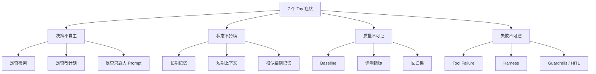

# Agent Toy 症状再分析：高 P 为什么怕 Demo，以及评论审核 Agent 该怎么对照自查

## 说明

这份文档基于你提供的文章内容重新做分析。

文章的核心价值很高，因为它不是在讲“Agent 多炫”，而是在讲：

`高阶面试官如何一眼识别你做的是工程项目，还是玩具 Demo。`

但如果只停留在口号层，也容易带来另一个误区：

- 把所有高级名词都堆上去
- 把一切问题都复杂化
- 误以为多模态、多 Agent、MCP、多记忆一定比简单方案高级

所以这次再分析的目标有两个：

1. 把文章里的 7 个 toy 症状拆成更本质的工程问题
2. 把这些工程问题映射到评论审核 Agent，讲清楚哪些必须做，哪些要看场景

---

## 结论先行

文章其实在说同一件事：

`高 P 最怕的不是你项目简单，而是你把一次性跑通的 Demo，包装成了可长期运行的系统。`

更准确地说，7 个 toy 症状可以归并成 4 个根因：

- `决策不自主`
  看似是 Agent，实则是写死流程
- `状态不持续`
  看似有 memory，实则不记忆、不回放、不积累
- `质量不可证`
  看似效果不错，实则没有 baseline、没有 eval、没有回归
- `失败不可控`
  看似能调工具，实则没有 harness、没有恢复、没有安全边界

如果一个项目这四类能力都缺，面试官几乎会立刻把它归为 toy。

---

## 1. 先给这篇文章一个整体评价

## 1.1 文章最对的地方

它抓住了面试里最关键的判断标准：

- 你能不能讲清楚设计原因
- 你能不能讲清楚系统边界
- 你能不能讲清楚失败和恢复
- 你能不能讲清楚自己比 baseline 强多少

这比“我用了哪个框架、哪个 API、哪个 Agent SDK”重要得多。

这点和 Anthropic、OpenAI 的官方实践建议完全一致。

Anthropic 说：

- 要先找最简单可行方案
- 必要时才增加复杂度
- 真正重要的是 workflow / agent 的适用边界

OpenAI 说：

- 客户通常在 incremental approach 上更容易成功
- 先 single-agent，再逐步增加 tools 和 handoffs
- evaluation 和 guardrails 是系统设计的一部分

来源：

- Anthropic
  [Building effective agents](https://www.anthropic.com/research/building-effective-agents/)
- OpenAI
  [A practical guide to building AI agents](https://openai.com/business/guides-and-resources/a-practical-guide-to-building-ai-agents/)

## 1.2 文章也需要补的一个边界

这篇文章的方向是对的，但如果直接照着“越多能力越工程化”去理解，会有偏差。

真正成熟的判断不是：

- 有没有多模态
- 有没有多 Agent
- 有没有 MCP
- 有没有 planner-executor-critic

而是：

- 这些设计是不是由业务问题推出来的
- 你有没有证据证明它们真的必要
- 它们有没有带来可测的改进

换句话说：

`高 P 讨厌 toy，也同样讨厌“复杂但没理由”的伪工程化。`

---

## 2. 7 个 toy 症状，本质上各自暴露了什么

## 2.1 “上次拒绝检索是什么时候？说不出来 = 写死了”

### 文章要点

如果 Agent 永远都查，或者永远都不查，那它没有真正的 retrieval decision。

### 工程本质

这条在考的是：

- 你的 Agent 有没有 `decision policy`
- 它能不能判断 `是否需要检索`
- 它能不能判断 `去哪个知识源检索`
- 它能不能判断 `当前证据是否已经足够`

如果做不到，那它不是 Agentic RAG，只是“永远查一下”的流水线。

### 为什么高 P 会敏感

因为真正的工程问题不是“能不能查”，而是：

- 查错库怎么办
- 查太多会不会浪费成本和时延
- 不该查的时候查，会不会引入噪声
- 查了以后怎么知道够不够

### 官方资料如何支撑

Anthropic 的 workflow/agent 区分其实就在强调：

- 有些场景应该用固定 workflow
- 有些场景才需要模型动态决定步骤

如果你宣称自己做了 Agentic RAG，却说不清检索决策逻辑，面试官自然会觉得你只是套模板。

来源：

- Anthropic
  [Building effective agents](https://www.anthropic.com/research/building-effective-agents/)

### 评论审核 Agent 对应什么

在评论审核里，这个问题应被改写为：

- 什么时候查 `policy`
- 什么时候查 `thread context`
- 什么时候查 `similar cases`
- 什么时候“不再补证，直接升级人工”

这比通用 RAG 更关键。

因为审核最怕的是：

- 证据不足却硬判
- 证据无关却被噪声带偏

### 应该怎么做

至少明确三段式决策：

- `need_retrieval`
- `need_more_retrieval`
- `evidence_sufficient`

### 可以怎么评测

- `retrieval_decision_accuracy`
- `unnecessary_retrieval_rate`
- `evidence_sufficiency_rate`
- `latency_per_case`

---

## 2.2 “记得上周偏好吗？说不出来 = 没有真记忆”

### 文章要点

如果系统无法跨轮、跨天保留有效用户信息，那所谓 memory 很可能只是上下文拼接。

### 工程本质

这条在考的是：

- 你的 memory 是不是有存储策略
- 什么信息值得长期保存
- 什么信息只属于短期上下文
- 召回时怎么防止错召、旧召、脏召

很多项目把“有向量库”误当成“有记忆”，这是高 P 很容易识别出的 toy 特征。

### 评论审核 Agent 的特殊性

评论审核里的“记忆”不是普通用户偏好记忆。

更重要的是：

- `prior_violation_count`
- `prior_appeal_overturns`
- `historical adjudication`
- `policy version`
- `reviewer_override history`

也就是说，这里的 memory 更偏：

- 风险历史记忆
- 审核一致性记忆
- 申诉敏感记忆

而不是“用户喜欢咖啡还是茶”那种 assistant memory。

### 本地项目对应

[agent.py](/Volumes/passport/简历/滴滴/src/commentops_agent_lab/agent.py#L34) 已经把：

- `prior_violation_count`
- `prior_appeal_overturns`
- `author_tenure_days`

纳入决策，这是一个正确方向。

但它现在还不是“真记忆系统”，因为：

- 数据是作为输入字段给进来的
- 没有长期写入策略
- 没有召回策略
- 没有 freshness / staleness 机制

### 应该怎么做

把 memory 分三层：

- `short-term session state`
- `case history memory`
- `adjudication memory`

### 可以怎么评测

- `memory_recall_precision`
- `stale_memory_error_rate`
- `historical_consistency_gain`

---

## 2.3 “比 baseline 强多少？说不出来 = 没有评估体系”

### 文章要点

如果你说不出比 baseline 强多少，基本说明：

- 没有量化指标
- 没有对照组
- 没有回归体系

### 工程本质

这条在考：

- 你是否知道系统的目标函数
- 你是否知道基线系统是什么
- 你是否知道自己到底改进了什么

OpenAI 的 evaluation best practices 明确强调：

- eval objective 必须先定义
- 数据集应来自 production、historical、domain expert data
- human feedback 要参与校准

来源：

- OpenAI
  [Evaluation best practices](https://developers.openai.com/api/docs/guides/evaluation-best-practices)

### 评论审核 Agent 里的 baseline 应该是什么

不能只拿“没有系统”当 baseline。

更合理的 baseline 有：

- keyword / rule-based baseline
- classifier-only baseline
- one-shot LLM classification baseline
- existing manual workflow baseline

### 本地项目对应

[eval.py](/Volumes/passport/简历/滴滴/src/commentops_agent_lab/eval.py#L28) 已经有：

- `action_accuracy`
- `policy_grounding_rate`
- `escalation_precision`
- `human_review_rate`
- `queue_routing_accuracy`

这已经比纯 demo 好很多。

但它仍然偏 toy，因为还缺：

- baseline 对照
- 分层切片
- 回归集
- appeal / override 指标
- high-risk recall

### 应该怎么做

至少固定三层评测：

- `overall metrics`
- `slice metrics`
- `regression metrics`

### 可以怎么表达

面试里不要只说：

- “效果提升了”

而要说：

- “相对 one-shot baseline，high-risk recall 提升 X%，human review rate 只增加 Y%，queue routing accuracy 提升 Z%。”

---

## 2.4 “折叠 Prompt 还剩几个 Agent？只剩一个 = 包打天下”

### 文章要点

如果所有能力都被塞进一个巨大 system prompt，那么所谓多 Agent 可能只是“一个 prompt 管天下”。

### 工程本质

这条在考的是：

- 系统有没有真正的 `separation of concerns`
- 逻辑有没有模块边界
- 角色分工是不是可替换、可评测、可维护

### 但这里有一个重要校正

这条不能被误读成：

- 单 Agent 一定差
- 多 Agent 一定高级

这是错误的。

Anthropic 和 OpenAI 都明确建议：

- 先 single-agent
- 先 simplest viable system
- 只有必要时才加 handoffs / multi-agent

所以真正的问题不是“只有一个 agent”，而是：

- 只有一个大 prompt
- 没有模块化边界
- 没有工具分工
- 没有状态结构

### 评论审核 Agent 里该怎么理解

评论审核核心链路其实很适合：

- bounded single-agent workflow

而不适合一开始就多 Agent。

更重要的是把链路按业务状态边界拆开：

- case intake
- context retrieval
- policy retrieval
- risk synthesis
- decision policy
- queue routing
- reviewer handoff

### 本地项目对应

[agent.py](/Volumes/passport/简历/滴滴/src/commentops_agent_lab/agent.py#L59) 已经按这个逻辑拆成多个步骤，但还没有真正的独立 node / graph runtime。

这比一个大 prompt 好，但距离完全工程化还有一步。

---

## 2.5 “丢一张截图会断？会断 = 纯文字系统”

### 文章要点

文章把多模态作为工程化的进阶分界线。

### 工程本质

这条在考：

- 你的系统是不是只在最干净的文本输入下工作
- 遇到现实世界的图像、截图、语音、附件时会不会崩

### 这里也要加一个边界

不是所有 Agent 都必须多模态。

更准确的说法应该是：

`如果业务本身天然是多模态，系统却只能处理纯文本，那就是 toy。`

对评论审核来说，是否需要多模态，取决于场景：

- 如果审核对象是纯评论文本，文本优先就对
- 如果审核流程里包含举报截图、会话截图、审核工单截图，那多模态能力就变得重要

### 评论审核 Agent 应该重点考虑的多模态

- 举报证据截图
- 上下文截图
- 用户上传的申诉材料
- 运营标注截图

### 正确态度

- 多模态是 `scenario-driven requirement`
- 不是“为了高级而硬加”

---

## 2.6 “会因中间结果改计划吗？说不出来 = 链路写死”

### 文章要点

如果系统不能根据中间结果调整计划，那它只是流程脚本。

### 工程本质

这条在考：

- 系统有没有 `adaptive control`
- 遇到证据不足、工具失败、结果冲突时会不会调整路径

### 但这里也要再加一个校正

不是所有业务都应当“强动态重规划”。

在评论审核这种高一致性场景里，很多主链路恰恰应该：

- 可预测
- 可审计
- 有界

所以更精确的要求不是“会不会改计划”，而是：

`当关键中间条件变化时，系统是否会切换到正确分支。`

比如：

- context 不足 -> escalate
- high-risk signal 出现 -> priority queue
- policy hit 冲突 -> reviewer review
- tool failure -> degrade or stop

### 评论审核 Agent 里真正需要的 adaptive behavior

- 证据不足时停止自动化
- 风险变高时收紧边界
- 相似 case 不一致时升级人工
- policy version 变化时触发回归 / 保守策略

### 本地项目对应

[agent.py](/Volumes/passport/简历/滴滴/src/commentops_agent_lab/agent.py#L276) 已经有：

- contextual expression -> escalate
- no context -> lower confidence / context gap
- high-risk benign -> shadow audit

这说明它不是完全死链路，但也还不算真正的 planner-based adaptive system。

---

## 2.7 “工具失败自动恢复？没有 = 无 Harness”

### 文章要点

这条其实是整篇文章最工程化的一条。

### 工程本质

Harness 的本质不是“多一层包装”，而是：

- 失败能被识别
- 失败能被约束
- 失败能触发恢复或升级
- 相同错误不会无止境重复发生

这点和“炼丹思维 vs 工程师思维”的区分非常一致。

Anthropic 和 LangGraph 的官方资料都在强调：

- agents 需要 verification loop
- tools 需要清晰边界
- long-running flows 需要 durable execution

来源：

- Anthropic
  [Writing effective tools for agents](https://www.anthropic.com/engineering/writing-tools-for-agents)
- LangGraph
  [Durable execution](https://docs.langchain.com/oss/python/langgraph/durable-execution)

### 评论审核 Agent 里 harness 的最小版本

- policy service fail -> fallback rule set
- similar case retrieval fail -> 不继续假装有一致性证据
- context load fail -> 直接进入人工
- queue route fail -> 放入 default safe queue
- audit write fail -> 不允许直接完成高风险动作

### 本地项目对应

当前 `commentops_agent_lab` 还基本没有真正的 recovery harness。

它有 `tool_trace`，但没有：

- retry policy
- fallback policy
- circuit breaker
- safe degrade
- failure budget

这正是它从“方向对的原型”走向“工程项目”最应该补的部分之一。

---

## 3. 文章里的“先别投”三条，为什么最关键

文章说的必做 3 条是：

- 检索决策
- 检索策略为什么选
- MCP 工具安全治理

我认同这个排序，而且它们分别对应三个最基础的工程能力。

## 3.1 检索决策 = 系统有没有真正的决策点

这决定你是不是“有大脑”，还是“有动作但没判断”。

## 3.2 能解释检索策略 = 你是不是真做过 trade-off

比如：

- 为什么不直接 keyword search
- 为什么不用 GraphRAG
- 为什么 policy retrieval 和 similar case retrieval 要分开
- 为什么优先 route 到哪类知识源

说不清 trade-off，说明设计不是你自己的。

## 3.3 MCP 安全治理 = 你是不是理解生产风险

这条非常关键。

真正的工程化分界线，很多时候不是“会不会接 MCP”，而是：

- 最小权限
- 高危操作禁止
- 调用审计
- 参数校验
- 输出约束
- 人工确认

这和 OpenAI/Anthropic 对 guardrails 与 tools 的建议完全一致。

---

## 4. 文章里的“进阶项”，哪些真加分，哪些要看场景

## 4.1 真正普适加分的

- `分层记忆`
- `Human-in-the-Loop`
- `上下文安全 / Policy Gate`
- `评估体系`
- `Harness 工程化`
- `模型路由`

这些几乎在所有工程型 Agent 里都有意义。

## 4.2 强场景依赖的

- `多模态输入`
- `Planner-Executor-Critic`
- `Skill 模块化`

这些不是不重要，而是：

- 只有当业务复杂度或输入形式真的需要时，才是加分项

### 关键判断标准

不是“有没有”，而是：

- 为什么需要
- 为什么这样拆
- 不这样会发生什么

---

## 5. 如果把文章观点映射到评论审核 Agent，最该看哪几条

我会给评论审核 Agent 一个重新排序。

## 5.1 评论审核场景里的必做项

### 第一名：policy-grounded evidence retrieval

不是“要不要检索互联网”，而是：

- 什么时候查 policy
- 什么时候查 context
- 什么时候查 similar cases
- 什么时候停止补证并升级人工

### 第二名：safe automation boundary

一定要有：

- `safe pass`
- `hard reject`
- `human review`

### 第三名：reviewer / appeal loop

你必须能回答：

- reviewer 接手时拿到什么
- appeal overturn 怎么回流
- reviewer override 如何回灌

### 第四名：failure harness

工具失败、证据不足、policy service 挂掉时怎么办。

### 第五名：eval + regression

至少要知道：

- 比 baseline 好多少
- 在哪些切片更好
- 哪些 case 还不稳

## 5.2 评论审核场景里的强加分项

- `similar case consistency memory`
- `shadow audit`
- `exposure-aware routing`
- `policy version regression set`
- `appeal-sensitive slice eval`

## 5.3 评论审核场景里不该过早追求的

- 多 Agent 架构
- 炫技式 planner-critic
- 复杂 UI
- 大规模训练

---

## 6. 用当前本地项目对照这篇文章，属于什么水平

我会给一个比较诚实的判断：

`当前 commentops_agent_lab 已经明显高于“随手 demo”，但还没有完全跨过工程化分界线。`

## 已经做对的部分

- 有 case schema，而不是裸文本分类
- 有 policy grounding 雏形
- 有三态边界 `pass / reject / escalate`
- 有 queue routing
- 有 risk signals
- 有 evaluation skeleton
- 有 failure review skeleton

对应证据：

- [agent.py](/Volumes/passport/简历/滴滴/src/commentops_agent_lab/agent.py#L28)
- [eval.py](/Volumes/passport/简历/滴滴/src/commentops_agent_lab/eval.py#L28)
- [training_data.py](/Volumes/passport/简历/滴滴/src/commentops_agent_lab/training_data.py#L133)
- [tests/test_commentops_agent_lab.py](/Volumes/passport/简历/滴滴/tests/test_commentops_agent_lab.py#L5)

## 还明显像 toy 的地方

- retrieval 决策还很浅，基本是规则命中，不是 agentic retrieval policy
- 没有真长期记忆体系
- 没有 baseline 对照和切片回归
- 没有真正的 harness / auto-recovery
- 没有 MCP / tool permission / approval 这类高风险治理
- 没有 multimodal path
- 没有强版本化和 rollout 机制

## 如果按文章标准打分

### 已命中的“非 toy”信号

- 能讲清一些 routing
- 有一定评测指标
- 有 failure review 思路

### 仍命中的 toy 症状

- 检索决策不足
- 无真记忆
- baseline 不完整
- harness 不足

所以它更准确的定位是：

- `工程化方向正确的审核 Agent 原型`

而不是：

- `成熟的生产级审核 Agent`

---

## 7. 面试里应该怎么讲这篇文章的观点，才不会显得空

你可以直接这样讲：

`我很认同把 Agent 项目分成 toy 和工程化这件事，但我不把工程化理解成堆更多高级名词。我更关注四件事：第一，系统有没有真正的决策点；第二，状态和记忆是不是持续存在；第三，效果能不能被 baseline 和 eval 证明；第四，工具失败和高风险动作有没有 harness、guardrail 和人工接管机制。`

如果再落到评论审核：

`评论审核 Agent 里，这四件事会具体落成 policy-grounded retrieval、safe automation boundary、reviewer/appeal loop 和 failure harness。真正成熟的不是“敢全自动”，而是知道什么时候能自动、什么时候必须停下来交给人。`

---

## 8. 一张总图：把文章的 7 个症状归并成系统能力

这张图的意义是：

- 不要孤立看 7 个症状
- 要把它们看成 4 类系统能力

只要你能按这 4 类组织项目和表达，面试官会明显感觉你不是在背概念。

---

## 9. 最终判断

这篇文章最有价值的地方，不是它列了 7 个症状，而是它在提醒你：

`真正的 Agent 工程项目，面试官最先看的是“你是否理解系统为什么会失败，以及你如何让它下一次不再这样失败”。`

如果把这句话翻译成评论审核 Agent 语言，就是：

`真正的审核 Agent 不是更会判，而是更知道什么时候该判、什么时候该停、什么时候该交给人，以及错了以后如何形成闭环。`

---

## 参考来源

- Anthropic
  [Building effective agents](https://www.anthropic.com/research/building-effective-agents/)

- Anthropic
  [Writing effective tools for agents](https://www.anthropic.com/engineering/writing-tools-for-agents)

- OpenAI
  [A practical guide to building AI agents](https://openai.com/business/guides-and-resources/a-practical-guide-to-building-ai-agents/)

- OpenAI
  [Evaluation best practices](https://developers.openai.com/api/docs/guides/evaluation-best-practices)

- OpenAI
  [Moderation guide](https://developers.openai.com/api/docs/guides/moderation)

- TikTok
  [Community Guidelines Enforcement](https://www.tiktok.com/community-guidelines/en/enforcement)

- Meta
  [Boosting Your Support and Safety on Meta’s Apps With AI](https://about.fb.com/news/2026/03/boosting-your-support-and-safety-on-metas-apps-with-ai/)

- YouTube
  [Building greater transparency and accountability with the Violative View Rate](https://blog.youtube/inside-youtube/building-greater-transparency-and-accountability/)

- YouTube
  [How we develop and enforce community guidelines and policies at YouTube](https://blog.youtube/inside-youtube/policy-development-at-youtube/)

## 置信度说明

整体判断：

- `▓▓▓▓░` 高置信度

高置信度部分：

- 文章的 7 个症状确实能概括高 P 对 toy Agent 的主要警惕点
- 将症状归并为决策、状态、评测、恢复四类工程能力是稳的
- 将这些能力映射到评论审核 Agent 的方法论与官方资料高度一致

较低置信度部分：

- 文章作者具体想强调的优先级细节
- 各公司在面试时对“多模态”“多 Agent”“Skill 模块化”的具体权重

## △ Caveats

- 这份分析基于你提供的文章正文，而不是微信原始排版和上下文，因此更偏“命题分析”。
- 高 P 面试官会看 toy 症状，但也同样会警惕“为了像工程而堆复杂度”的伪工程化。
