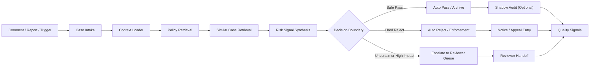
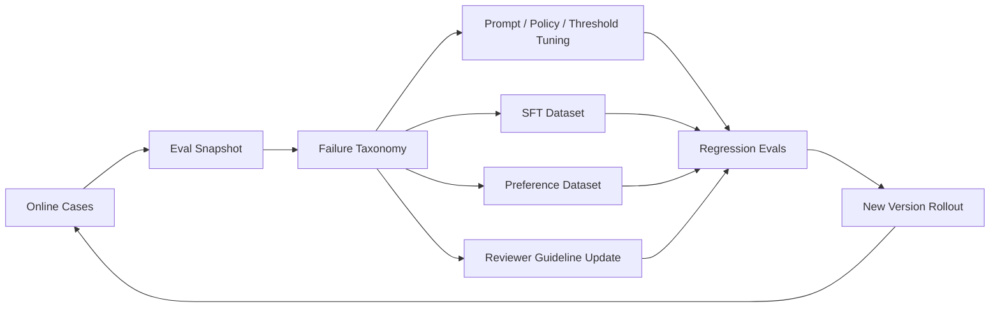
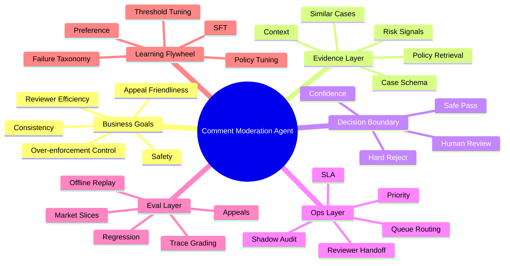

# 评论审核 Agent 学习手册

## 适用场景

这份手册面向两类目标：

1. 你想真正理解“评论审核 / 内容治理 / Trust & Safety Agent”在做什么业务。
2. 你想把这类项目讲成一个有业务深度、有评测闭环、有迭代方法论的项目，而不是“我做了个审核分类器”。

这份文档故意把内容分成三层：

- 业务理解：为什么这个问题不是普通 NLP 分类
- 系统框架：做 Agent 之前，哪些事情必须先定清楚
- 迭代路线：如何从一个原型稳步升级成更像大厂实践的系统

同时，文档会把关键指标、知识地图和官方信息源绑在一起，方便你学习和面试表达。

## 一句话定义这个业务

评论审核 Agent 不是“让大模型判断一条评论是否违规”，而是：

`在明确 policy 约束下，对评论 case 进行证据收集、风险合成、自动化边界判断、人审协同和持续优化的业务系统。`

这句话里每个词都重要：

- `policy 约束`
  说明不是自由发挥
- `评论 case`
  说明对象不是孤立文本，而是带上下文和历史信号的 case
- `证据收集`
  说明先取证再判断
- `自动化边界`
  说明不是一味追求全自动
- `人审协同`
  说明 reviewer 不是兜底 bug，而是系统的一部分
- `持续优化`
  说明没有 eval 和回灌，就不是真正的 Agent 体系

## 1. 先建立正确的业务心智

### 1.1 这个业务在优化什么

真实平台在评论审核上同时优化五件事：

- 平台安全：高风险评论别漏放
- 误杀控制：正常讨论不要被粗暴打掉
- 运营效率：reviewer 不要重复搜证
- 策略一致性：同类 case 不要前后尺度漂移
- 申诉友好度：被打掉的内容要可复核、可解释、可申诉

这五个目标之间天然存在张力。

举例：

- 自动放得越多，人工成本越低，但漏放风险可能上升
- 自动拦得越狠，安全感可能更强，但误杀和申诉压力会上升
- 升级人工越保守，准确率可能更高，但 reviewer 吞吐和 SLA 会恶化

所以这不是单一的模型优化问题，而是一个多目标系统设计问题。

### 1.2 为什么这不是普通分类问题

如果把评论审核简化成“违规则 1，不违规则 0”，你会丢掉最关键的业务要素：

- 上下文依赖：反讽、引用、楼中楼常常要结合 thread 才能判断
- 规则依据：系统必须说清楚依据哪条 policy
- 历史风险：举报量、违规史、申诉翻案史会改变处置方式
- 人工协同：系统不仅要判，还要决定是否升级人工
- 运营流程：同一个 action 还会对应不同 queue、priority 和 SLA
- 策略变更：policy 更新后，要做回归评测

所以，正确抽象不是 `text classification`，而是：

`stateful moderation workflow`

## 2. 如果你做 Agent，必须先确定好的框架

这里是最关键的一节。

很多人做 Agent 失败，不是因为模型不够强，而是因为在开工前根本没有把系统边界定清楚。

### 2.1 先确定“审核单元”

你必须先回答：

- 你的审核对象是一条 comment，还是一个 case？
- case 里包含哪些字段？
- 哪些字段是决策必须项，哪些只是辅助项？

推荐最小 case schema：

- `comment_text`
- `thread_context`
- `policy_version`
- `reporter_count`
- `prior_violation_count`
- `prior_appeal_overturns`
- `author_tenure_days`
- `locale / market`
- `reach / popularity`
- `reviewer_override`
- `appeal_outcome`

如果没有 case schema，后面所有 evidence、decision、eval、training 都会漂。

### 2.2 先确定“动作空间”

不要一上来只做 `pass / reject`。

更稳的动作空间是：

- `pass`
- `reject`
- `escalate`

必要时再继续细化：

- `pass_with_shadow_audit`
- `restrict_distribution`
- `priority_escalate`
- `appeal_replay`

动作空间决定你在业务上是不是“有边界的自动化”。

### 2.3 先确定“证据契约”

每个自动决策都至少要能回答四件事：

1. 命中了什么 policy
2. 依据了哪些证据
3. 为什么能自动判
4. 如果升级人工，是因为什么不确定性

推荐输出契约：

- `action`
- `primary_category`
- `policy_clause_ids`
- `evidence_spans`
- `confidence`
- `rationale`
- `escalation_reason`
- `queue_routing`

### 2.4 先确定“自动化边界”

真正的 Agent 设计重点不是“模型怎么思考”，而是“系统在哪些区域可以安全自动化”。

最推荐的边界结构：

- `hard reject zone`
  明确违规、高确定性、高危类
- `safe pass zone`
  明确安全、低风险、低争议类
- `human review zone`
  上下文依赖、规则争议、证据不足、申诉敏感类

### 2.5 先确定“人工协同策略”

人工不是失败补丁，而是业务设计的一部分。

你要先定清楚：

- 哪些 case 一定升级人工
- 人工接手时能看到哪些 evidence
- queue 怎么分
- priority 怎么分
- SLA 怎么分
- human override 如何回流到系统

### 2.6 先确定“版本化对象”

这个场景里最容易被忽略的是版本治理。

至少要版本化：

- `policy version`
- `prompt version`
- `tool contract version`
- `routing threshold version`
- `eval dataset version`

否则你后面看到效果变化时，根本不知道是哪里改坏了。

## 3. 用一张图看清整个系统

### 3.1 在线审核主链路

这张图最重要的含义是：

- 决策前必须先有 evidence
- 决策后必须进入运营流程
- 在线链路的终点不是 action，而是 quality signals

### 3.2 离线优化闭环

这张图表达的是：

- 错判不是“修 prompt 就完了”
- 失败样本要先归因，再决定流向
- 有些问题应该修 policy，有些该修 threshold，有些才该进训练

## 4. 主流大厂已经公开释放出的方向信号

下面只保留和这个业务最相关、最有约束力的公开信号。

### 4.1 TikTok：自动化率重要，但 additional review、notice、appeal 同样重要

TikTok 在 2024 年 12 月 18 日的透明度说明里披露：

- 2024 年 7 月到 9 月移除了超过 1.47 亿条违规视频
- 同期移除了超过 13 亿条评论
- 目前超过 80% 的移除由自动化完成
- 已经按季度、多语言发布透明度指标，并持续扩充指标维度

这说明：

- 评论治理是超大规模业务
- 自动化覆盖率是核心目标之一
- 但必须有透明度报表和多维指标

TikTok 的 Enforcement 页面在 2025 年 9 月 13 日更新时还明确写到：

- 内容先走 automated review
- 潜在违规内容会自动移除，或交给 moderator 做 additional review
- 热门内容和被举报内容会追加 review
- 被限制或被移除的内容可以 appeal

这对 Agent 设计的直接约束是：

- 不能只做 one-shot 判定
- 必须有 `pass / reject / escalate`
- 必须给 appeal 和 replay 预留结构
- 必须把“追加审核”当成系统常态，而不是异常

### 4.2 TikTok 官方岗位：Agent 要检索 supporting evidence，并结合 model reasoning、policy logic、human review

TikTok Safety Product 的公开岗位职责里明确写到：

- success metrics 要反映 platform integrity outcomes
- 目标要同时降低 leakage 和 over-enforcement
- 要设计能检索 `supporting evidence` 的 `agentic workflows`
- 要把 `model reasoning`、`policy logic` 和 `human review` 结合起来

这几句话其实已经把评论审核 Agent 的主框架说透了：

- 不是纯 prompt 分类
- 不是只看 final label
- 不是只拼模型能力
- 而是 evidence、policy、human review 的系统工程

### 4.3 Meta：AI 负责规模化和一致性，但高影响决策仍由人做

Meta 在 2026 年 3 月 19 日发布、3 月 20 日更新的官方文章里强调：

- AI 能帮助更快、更大规模地处理严重违规内容
- AI 不替代 human judgment，而是帮助更一致地应用 judgment
- 专家负责设计、训练、监督、评估系统
- 高风险和高影响决策，例如 appeals，仍由人承担关键角色
- 系统必须经过严格 testing，并防范 bias，保证 consistency 和 accuracy

这意味着真正成熟的 Agent 系统不是“全自动”，而是：

- 低价值重复工作自动化
- 高风险复杂判断人工兜底
- 全链路有测试和质量保障

### 4.4 YouTube：平台真正看重的是“伤害暴露率”，不是只看分类准确率

YouTube 官方长期使用 `Violative View Rate (VVR)` 作为责任治理核心指标。

它的含义是：

- 平台不是只关心某条内容有没有判对
- 更关心用户到底看到了多少违规内容

YouTube 2021 年 4 月 6 日的官方文章解释了：

- VVR 是违规内容在总观看量中的占比
- 这是公司内部衡量治理效果的核心指标
- 即使 removal turnaround time 重要，也不如 exposure 型指标能反映真实影响
- policy 更新后，VVR 可能短期上升，因为系统要重新适应新规则

这对评论审核场景有很强启发：

- 不能只看 action accuracy
- 更该看高风险评论在曝光链路上的停留与触达
- 热门帖下的漏放比普通帖更严重

### 4.5 YouTube：policy 不是“写完就上线”，而是持续测试、校准和复盘

YouTube 官方关于 policy development 的说明提到：

- 定 policy 时要看很多内容样本，评估不同 policy line 的影响
- success 不靠单一指标定义
- 会跟踪 appeals 和 reinstatements
- 会持续做质量讨论和校准

这说明评论审核 Agent 的上层不是模型，而是 policy operation。

如果你未来面试只讲模型，而不讲：

- policy authoring
- reviewer calibration
- appeal review
- policy update regression

你的业务理解会显得偏浅。

### 4.6 Jigsaw / Perspective：模型分数只是辅助信号，不是最终裁决

Perspective API 官方文档明确说：

- 它的目标是让 moderation easier
- 它不是为了 completely replace human decision-makers

这对审核 Agent 的意义非常大：

- detector score 不等于 final action
- 基础分数层只能作为辅助信号
- 评分层之后还要有 policy grounding、decision boundary、queue routing

### 4.7 OpenAI：Agent 和模型都应当围绕 eval 驱动迭代，而不是凭感觉调

OpenAI 的官方文档有几条对 Agent 设计非常关键：

- Agent evals 指南明确建议对 workflow-level error 做 `trace grading`
- Evaluation best practices 强调：
  - 先定义 eval objective
  - 用 production data、domain expert data、historical data 共同构建数据集
  - 持续评测，不是跑一次
  - LLM 更适合做 pairwise comparison、classification、criteria-based scoring
  - human feedback 要用来校准 automated scoring
- Model optimization 指南明确把优化流程定义成：
  - 写 eval
  - 跑 prompt
  - 必要时 fine-tune
  - 用 representative test data 回测
  - 持续重复这个 flywheel

这基本等于告诉你：

`先做 eval，再做 prompt，再决定要不要训练。`

## 5. 评测指标怎么搭才像真正业务系统

不要只问“准确率多少”。

推荐按四层指标来搭。

## 5.1 第一层：在线质量指标

这些指标回答的是：

`系统判得是否靠谱？`

| 指标 | 定义 | 为什么重要 | 典型数据来源 |
|---|---|---|---|
| `action_accuracy` | 最终动作与 gold label 一致的比例 | 最基础质量指标 | 离线标注集 / 人工复核集 |
| `category_accuracy` | 违规类别判断是否正确 | 关系到后续处置和一致性 | 标注集 |
| `policy_grounding_rate` | 决策是否能落到明确 policy clause | 没 grounding 的审核不可审计 | 决策 trace |
| `high_risk_recall` | 高风险 case 被正确拒绝或升级的比例 | 防止严重漏放 | 高危专项集 |
| `over_enforcement_proxy` | 被误打掉或误升级的安全样本比例 | 衡量误杀 | appeal / QA |
| `under_enforcement_proxy` | 应拦未拦的比例 | 衡量漏放 | audit / QA |
| `consistency_on_similar_cases` | 相似 case 处置一致性 | 审核业务非常看重尺度稳定 | adjudication memory |
| `low_confidence_auto_action_rate` | 低置信却自动 pass/reject 的比例 | 自动化边界是否鲁莽 | trace + confidence |

### 你要特别理解的两个指标

#### `policy_grounding_rate`

这是审核 Agent 和普通分类模型的分水岭。

如果一个系统能判对，但说不清依据哪条规则，那么它：

- 很难审计
- 很难申诉复核
- 很难训练回灌
- 很难做 policy version 回归

#### `high_risk_recall`

在内容治理里，很多时候这比整体 accuracy 更重要。

因为高危 case 的业务成本不对称。

- 放错一个高危威胁 case 的损失
- 和放错一个普通安全 case 的损失

不是一个数量级。

## 5.2 第二层：运营效率指标

这些指标回答的是：

`系统有没有真正帮业务提效，而不是把复杂度转嫁给 reviewer？`

| 指标 | 定义 | 为什么重要 | 典型数据来源 |
|---|---|---|---|
| `human_review_rate` | 进入人工复核的 case 比例 | 太高会压垮 reviewer | queue logs |
| `queue_routing_accuracy` | 路由到正确队列的比例 | 路由错会直接打乱运营流程 | queue + gold queue |
| `priority_correctness` | 优先级判定是否合理 | 高危类要抢 SLA | queue logs |
| `reviewer_throughput` | reviewer 单位时间处理量变化 | 是否真正提效 | ops dashboard |
| `evidence_ready_rate` | reviewer 接手时证据是否齐全 | 直接影响搜证成本 | reviewer audit |
| `priority_queue_sla` | 高优先队列是否按时处理 | 防止高危 case 滞留 | queue timestamps |
| `shadow_audit_hit_rate` | shadow audit 里发现问题的比例 | 评估 guarded auto-pass 是否有效 | QA / audit |

### 你要特别理解的一个指标

#### `evidence_ready_rate`

很多 Agent demo 看起来“很聪明”，但 reviewer 接手以后还得重新搜一遍上下文、规则、历史 case。

那它不是提效系统，只是把工作换了一种形式。

## 5.3 第三层：治理稳定性指标

这些指标回答的是：

`系统是不是能长期稳定运行，而不是一次性 demo 成功？`

| 指标 | 定义 | 为什么重要 | 典型数据来源 |
|---|---|---|---|
| `appeal_overturn_rate` | 被申诉后推翻的比例 | 衡量误杀与解释不足 | appeal logs |
| `reviewer_override_rate` | reviewer 改写系统决策的比例 | 说明边界或 evidence 设计有问题 | reviewer tool logs |
| `policy_version_regression_rate` | policy 更新后旧能力回退比例 | 真实平台一定会频繁改 policy | regression evals |
| `market_drift_rate` | 不同市场/语言表现偏移 | 全球平台尤其重要 | locale sliced evals |
| `bias_watch_metrics` | 对不同群体/语种/题材是否系统偏差 | 合规与公允性问题 | segmented audits |
| `appeal_sensitive_error_rate` | 高申诉敏感样本上的错误率 | 这类 case 对平台信任影响最大 | appeal-focused eval set |

## 5.4 第四层：学习飞轮指标

这些指标回答的是：

`系统有没有把错误真正转化成升级燃料？`

| 指标 | 定义 | 为什么重要 | 典型数据来源 |
|---|---|---|---|
| `failure_taxonomy_coverage` | 失败样本能否被稳定归因 | 不归因就没法优化 | failure review |
| `trainable_case_yield` | 可进入 SFT / preference / rule tuning 的样本产出量 | 闭环效率 | triage pipeline |
| `preference_signal_density` | 一段时间内可形成 chosen/rejected 对的数据密度 | 是否适合做偏好优化 | reviewer / appeal data |
| `regression_eval_growth` | 回归集是否随真实问题增长 | 是否在持续学习 | eval dataset versions |
| `prompt_or_policy_fix_hit_rate` | 经修复后同类错误下降比例 | 评估优化手段有效性 | before/after evals |

## 6. 如何把这些指标变成可执行评测

很多人知道指标名字，但不会真正把它们跑起来。

推荐按四类评测来落地。

### 6.1 离线回放评测

数据集至少分层：

- 明确违规
- 明确安全
- 上下文敏感
- 举报驱动高风险
- 历史高风险用户
- appeal overturn
- reviewer disagreement
- policy version regression
- 高曝光场景
- 多语言 / 多市场样本

离线回放要回答：

- 最终动作是否对
- policy 是否对
- evidence 是否够
- queue 是否对
- 低置信 case 是否被错误自动化

### 6.2 Trace 级评测

这是 Agent 场景区别于普通模型评测的关键。

你不只看 final action，还要看：

- context 有没有取全
- tool 有没有选对
- arguments 有没有传对
- policy clause 有没有取错
- risk signal 有没有漏掉
- reviewer handoff 信息是否齐全

如果 final action 错了，但 trace 里其实 evidence 已经齐了，那么问题可能是 decision policy。

如果 final action 错了，且 trace 里根本没取到上下文，那问题就在 evidence layer。

### 6.3 Shadow mode / 审计抽检

这一步非常像真实业务。

系统不直接放权，而是：

- 先并行给出建议 action
- 不直接生效
- 跟人工结果比
- 对关键切片做 QA 深挖

这一步适合验证：

- 自动化边界是否过激
- queue routing 是否合理
- 哪类样本最容易误杀或漏放

### 6.4 Appeal / reviewer 回灌评测

这类数据价值极高，因为它比离线静态标注更接近真实业务冲突点。

重点观察：

- 哪类 case 最容易被 reviewer override
- 哪类 case 最容易 appeal overturn
- 哪些错误来自 evidence 缺失
- 哪些错误来自 policy 定义不清
- 哪些错误来自阈值或 routing 设计不合理

## 7. 你需要掌握的知识地图

如果你想在面试里显得真的懂业务，不能只会讲模型和 prompt。

至少要有这张知识地图。

### 7.1 业务知识地图

| 知识域 | 你要理解什么 | 为什么重要 |
|---|---|---|
| `Policy` | 规则结构、条款边界、版本变更、灰区定义 | 决策依据和回归起点 |
| `Ops` | 队列、优先级、SLA、产能、抽检、申诉流程 | 决策要落入真实运营流程 |
| `QA / Calibration` | 审核一致性、复核、质检、RCA | 没 calibration 就没有稳定性 |
| `Data` | case schema、事件埋点、样本切片、数据版本 | 没数据就没有闭环 |
| `Model / Agent` | prompt、tool、state、trace、threshold | 决定自动化边界和稳定性 |
| `Learning Loop` | SFT、preference、rule tuning、prompt tuning | 错误如何转成下一轮改进 |
| `Appeal / Fairness` | 翻案、偏差、解释、notice | 决定平台信任和合规风险 |
| `Experimentation` | A/B、shadow mode、分层 rollout、guardrail | 防止错误放大 |

### 7.2 面试里经常被追问但容易忽略的知识点

- 什么 case 适合自动 pass，什么一定要 escalate？
- policy 更新后你怎么做回归？
- 你的 high-risk recall 和 over-enforcement 怎么平衡？
- reviewer 为什么会 override 你的系统？
- 你如何定义 failure taxonomy？
- 什么错误该修 prompt，什么错误该修 rule，什么错误才该进训练？
- 为什么不是一开始就做 multi-agent？

## 8. 推荐的可迭代升级路线

下面这条路线适合学习，也适合项目落地。

## 8.1 V0：工作流原型

目标：

- 先把业务链路表达出来

要做的事：

- 明确 case schema
- 明确三态动作空间
- 把 `case -> evidence -> decision -> routing` 跑通
- 保留基础 trace

不要做的事：

- 不要一开始就上多智能体
- 不要一开始就上复杂 UI
- 不要一开始就讲大规模训练

完成标志：

- 能稳定处理几个典型 case
- 能输出 policy-grounded action
- 能说明为什么升级人工

## 8.2 V1：证据层升级

目标：

- 让系统不再只是“规则命中”，而是真正开始取证

要做的事：

- 引入 `policy retrieval`
- 引入 `similar case retrieval`
- 引入更清晰的 `evidence bundle`
- 把 evidence 缺失单独做 failure taxonomy

完成标志：

- reviewer 接手时不需要从零搜证
- trace 里能明确看出 evidence 是否齐全

## 8.3 V2：运营协同升级

目标：

- 让结果真正进入业务流程

要做的事：

- 细化 queue routing
- 增加 priority 与 SLA
- 增加 shadow audit
- 增加 reviewer handoff note

完成标志：

- 系统不只输出 label，还输出可操作的运营动作

## 8.4 V3：评测平台升级

目标：

- 让系统可以稳定回归，不靠感觉调

要做的事：

- 分层 benchmark
- trace grading
- policy version regression set
- appeal-sensitive slice
- locale / market slice

完成标志：

- 每次改 prompt、tool、policy 都能回归
- 能看清是哪个层出问题

## 8.5 V4：学习飞轮升级

目标：

- 把 reviewer 和 appeal 信号变成训练和策略优化燃料

要做的事：

- reviewer override 回流
- appeal overturn 回流
- disagreement case 回流
- SFT / preference / rule tuning 分流

完成标志：

- 每一类失败都有清晰流向
- 不再把所有问题都归结为“模型不够强”

## 8.6 V5：更高级架构，只在有证据时再上

目标：

- 在确有必要时升级到更复杂的架构

可能的升级：

- LangGraph / StateGraph
- 更强的 adjudication memory
- specialized sub-workflows
- multi-agent handoff

前提：

- eval 已证明当前单 Agent / workflow 有明确瓶颈
- 不是为了“看起来高级”而升级

## 9. 为什么我不建议你一开始就做 multi-agent

这是面试里很容易讲得很泛的地方。

推荐的回答逻辑是：

1. 这个业务高约束、高审计、高一致性。
2. 第一版最重要的是把 evidence、decision、routing、appeal 这些边界定义清楚。
3. multi-agent 会额外引入 handoff、角色冲突、trace 复杂度和更多 nondeterminism。
4. 如果 eval 还没证明单 Agent / workflow 不够，多智能体通常只会增加复杂度。

你可以直接说：

`我会先把它做成 bounded single-agent workflow，等到 eval 证明单 Agent 在 evidence retrieval、tool selection 或跨子域协作上出现稳定瓶颈，再考虑拆成 specialized agents。`

这个表达会比“我想做一个多智能体审核系统”成熟很多。

## 10. 把这套业务讲给面试官听，应该怎么表达

### 10.1 一分钟版本

`我做的不是一个评论分类 demo，而是一个评论审核 Agent 工作流。它先把评论、上下文、用户历史、举报和 policy version 组织成 case，再去做 policy grounding、相似 case 检索和风险合成，最后决定是自动 pass、自动 reject，还是升级人工。系统的重点不是模型多聪明，而是自动化边界是否安全、reviewer 接手是否高效，以及 reviewer override、appeal overturn 能不能进入后续 eval 和训练闭环。`

### 10.2 三分钟版本

可以按这四层讲：

- `Evidence Layer`
  我不是裸文本判定，而是先拉 case 证据
- `Decision Boundary`
  我不是一味追求全自动，而是做 safe pass / hard reject / escalate
- `Ops Routing`
  我输出的不只是 label，还有 queue、priority、SLA 和 reviewer handoff
- `Learning Flywheel`
  我把 failure review、appeal、override 反向沉淀成 SFT、preference、policy tuning 和回归评测

### 10.3 如果面试官问“你这个 Agent 的核心价值是什么”

推荐回答：

`核心价值不是替代所有 reviewer，而是把低价值、低风险、可解释的部分自动化，把高风险和高争议 case 更稳定地升级给人工，同时把整个过程做成可评测、可回归、可回灌的系统。`

## 11. 结合当前本地项目，你接下来该怎么学

当前仓库里的 `commentops_agent_lab` 已经非常适合拿来学这条主线。

建议按下面顺序学习。

### 第一步：看懂现有 workflow

重点理解：

- case 里有什么字段
- risk signal 是怎么合成的
- decision 和 queue routing 是怎么分开的
- failure review 为什么单独成模块

### 第二步：自己重写一遍指标解释

不是背指标名，而是自己能讲清楚：

- 这个指标回答什么业务问题
- 为什么不能只看 accuracy
- 这个指标的数据从哪来
- 这个指标升高或降低说明什么

### 第三步：自己给项目补一版分层评测集

建议你至少补：

- 明确安全
- 明确违规
- 上下文敏感
- 申诉敏感
- 高举报量低文本风险
- policy 更新回归
- 多语言 / 方言 / 口语化表达

### 第四步：开始练 failure taxonomy

每个错误都先判断它属于：

- evidence 问题
- policy 问题
- threshold 问题
- routing 问题
- training 问题

这个能力一旦建立起来，你对业务的理解会明显更像真正做过系统的人。

## 12. 最后给你一个总框架

如果你以后只想记住一张脑图，就记住这张。

如果你能把这张图真正讲顺，你就不只是会“做一个 Agent”，而是已经开始具备：

- 业务抽象能力
- 系统设计能力
- 指标设计能力
- 质量闭环能力

这四个能力，比单独会写 prompt 重要得多。

## 13. 参考信息源

以下信息源用于支撑这份手册中的关键判断。

### 平台治理与内容审核

- TikTok Newsroom, December 18, 2024
  https://newsroom.tiktok.com/en-US/bringing-even-more-transparency
  关键信号：评论治理规模、自动化覆盖率、透明度报告与多指标公开

- TikTok Community Guidelines Enforcement, updated September 13, 2025
  https://www.tiktok.com/community-guidelines/en/enforcement
  关键信号：automated review、additional review、notice、appeal

- TikTok Safety Product Job Posting, crawled March 2026
  https://lifeattiktok.com/search/7554140353420380424
  关键信号：supporting evidence、platform integrity outcomes、reduce leakage and over-enforcement、human review

- Meta, March 19/20, 2026
  https://about.fb.com/news/2026/03/boosting-your-support-and-safety-on-metas-apps-with-ai/
  关键信号：AI 与人类 judgment 的分工、高影响决策人工兜底、testing / safeguards / bias / consistency

- YouTube Official Blog, April 6, 2021
  https://blog.youtube/inside-youtube/building-greater-transparency-and-accountability/
  关键信号：Violative View Rate、暴露型治理指标、policy 更新带来的回归波动

- YouTube Official Blog, August 30, 2023
  https://blog.youtube/inside-youtube/policy-development-at-youtube/
  关键信号：policy line、appeals、质量与一致性校准、非单一指标治理

- Google for Developers, Perspective API Codelab
  https://developers.google.com/codelabs/setup-perspective-api
  关键信号：moderation aid，不替代 human decision-makers

### Agent、Eval 与优化方法

- OpenAI, Agent Evals
  https://developers.openai.com/api/docs/guides/agent-evals
  关键信号：workflow-level trace grading、可复现 agent evals

- OpenAI, Evaluation Best Practices
  https://developers.openai.com/api/docs/guides/evaluation-best-practices
  关键信号：eval objective、dataset design、continuous evaluation、task-specific metrics、human calibration

- OpenAI, Model Optimization
  https://developers.openai.com/api/docs/guides/model-optimization
  关键信号：eval -> prompt -> fine-tuning 的持续 flywheel、代表性测试数据、非确定性模型要持续测量

## 14. 置信度说明

整体判断：

- `▓▓▓▓░` 高置信度

高置信度部分：

- 评论审核 Agent 应按 workflow 而不是分类器来建模
- 评测指标必须同时覆盖质量、运营、稳定性和学习飞轮
- 主流平台普遍强调自动化与人工协同并存
- 官方资料一致支持 evidence、appeal、transparency、continuous evaluation 这些方向

较低置信度部分：

- 各家公司内部具体阈值、队列划分、SLA 和资源分配细节
- 国内未公开平台的内部 RCA 口径和标注体系

## △ Caveats

- 平台公开资料能帮助建立方法论，但不能替代内部 SOP
- 不同平台会因政策、市场和合规要求不同而采用不同阈值
- 这份手册的价值在于帮助你建立业务抽象和系统判断，而不是给出唯一实现答案
