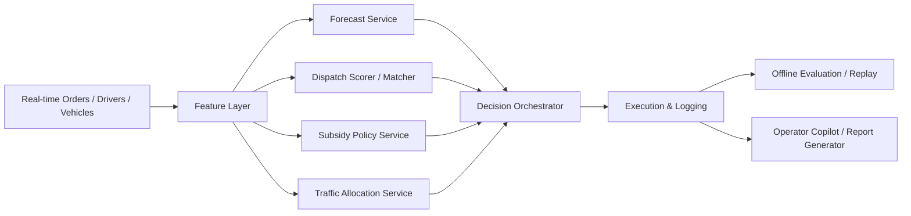

# 滴滴货运场景题与 System Design / Vibe Coding 答案

## 推荐场景题

设计一个同城货运智能交易系统。平台实时接收货主订单和司机供给，需要在有限补贴预算下，决定订单曝光、派单优先级和定向激励策略，同时平衡完单率、履约时效、补贴 ROI 和市场公平性。

## 一句话答法

我会把系统拆成“预测层 + 决策层 + 评估治理层 + 解释协同层”四层，其中核心决策仍由显式模型、规则和优化逻辑承担，LLM 主要放在策略解释、复盘分析和运营协同层。

## 一、先把输入输出讲清楚

### 输入

- 订单流
- 司机与车辆状态
- 区域与时间窗
- 历史成交与响应数据
- 补贴预算和策略约束
- 流量分发规则

### 输出

- 订单曝光顺序
- 派单候选与优先级
- 补贴策略
- 关键指标监控和策略解释

## 二、核心架构

## 三、四层结构怎么讲

### 1. 预测层

这层回答：

- 哪些区域接下来会缺车
- 哪类订单更难完成
- 哪些司机更可能响应某类订单

你可以说这里用：

- demand forecasting
- supply forecasting
- response / fulfillment prediction

作用不是直接做最终决策，而是给后续 dispatch / subsidy / traffic 提供状态感知。

### 2. 决策层

这层是核心。

我会拆成三个服务：

- `dispatch scorer / matcher`
- `subsidy policy service`
- `traffic allocation service`

#### dispatch scorer / matcher

负责根据距离、时效、车型、区域压力、响应概率等因素做综合打分，并在必要时考虑 assignment 约束。

#### subsidy policy service

负责判断补贴该给谁、在哪个区域、什么时段给。关键不是找到“高概率完成的人”，而是找到“因为激励才会产生增量完成”的人群。

#### traffic allocation service

负责决定订单曝光和机会分配，避免过度集中给少数司机，同时兼顾效率和公平。

### 3. 评估治理层

如果没有这层，整个设计会显得像一个 demo，而不是平台系统。

至少要包括：

- offline replay evaluation
- baseline vs new policy comparison
- budget cap 和 guardrail
- fallback rules
- 指标异常报警

重点指标：

- match rate
- response / acceptance rate
- fulfillment rate
- pickup distance proxy
- subsidy spend
- subsidy ROI
- exposure concentration

### 4. 解释协同层

这就是 LLM 最合适的位置。

它做的事情包括：

- 用自然语言解释“为什么这个区域今天补贴更高”
- 给运营生成策略日报
- 帮策略同学快速复盘异常区域
- 把结构化指标翻译成更容易交流的结论

不要把它讲成：

- LLM 直接做派单求解
- LLM 直接取代补贴引擎

## 四、面试里最容易加分的点

### 1. 明确说出“先预测，后决策，最后评估”

这是平台策略系统最稳的主线。

### 2. 明确说出“相关性不等于增量价值”

只要你把补贴和因果关联起来，面试官通常会觉得你抓到了重点。

### 3. 明确说出“局部最优不等于全局最优”

这是 dispatch / matching 类问题里非常关键的一句话。

### 4. 明确说出“短期效率和长期供给健康有冲突”

这是流量分发和补贴策略的核心业务感。

## 五、如果面试官追问技术实现

### 最简工程落地

- `data.py` 负责模拟 market day
- `forecast.py` 负责需求 / 供给 / 响应预测
- `dispatch.py` 负责打分与匹配
- `subsidy.py` 负责 uplift 风格的激励策略
- `traffic.py` 负责曝光分发
- `eval.py` 负责 KPI 比较
- `app.py` 负责 dashboard 和 explanation

这套结构和 `FreightStrategyLab` 是完全对齐的。

## 六、怎么回答 “如果让你用 Codex / vibe coding 很快做出来？”

最好的讲法不是“我让 AI 帮我写完全部系统”，而是：

> 我会把业务边界、输入输出 schema、指标定义和 guardrail 先钉死，再用 Codex 先快速搭出 simulator、评估 harness、服务接口和 dashboard。像预测 baseline、指标看板、回放评测、策略报告这些模块非常适合用 AI 提效；但 dispatch 约束、补贴预算规则和关键 KPI 校验必须显式写清楚，不能把核心业务约束交给模型自由发挥。

## 七、Vibe Coding 的正确分工

### 适合交给 Codex 的部分

- 数据 schema 和 Pydantic model
- 合成数据生成器
- baseline model scaffolding
- OR-Tools demo 约束样例
- 指标计算器
- FastAPI / Streamlit 骨架
- dashboard 和 demo script
- 策略报告模板

### 不适合“放飞生成”的部分

- 核心业务目标定义
- 补贴预算约束
- KPI 口径
- fallback 规则
- 线上实验准入标准

## 八、最后 90 秒标准答案

> 如果让我设计一个同城货运智能交易系统，我会先把它拆成四层。第一层是预测层，去建模区域供需、司机响应和订单履约概率；第二层是决策层，把这些预测结果输入到 dispatch、subsidy 和 traffic allocation 三个服务里，分别解决派单优先级、激励策略和曝光分配；第三层是评估治理层，通过 replay、baseline 对比、预算 guardrail 和异常监控保证策略可控；第四层是解释协同层，用 LLM 给运营和策略同学生成“为什么这样决策”的分析和复盘。  
>  
> 这里我会特别强调两点。第一，补贴问题不能只看相关性，要看增量价值，所以要有 treatment effect 或 uplift 的思路；第二，派单和分发不是局部排序题，而是有全局资源约束和长期供给健康权衡的市场优化问题。如果让我快速落地一个 demo，我会先用 Codex 把 simulator、baseline、评估 harness 和 dashboard 搭出来，但关键业务约束和指标口径会手动钉死，保证这个系统像平台工程，而不是一个泛 AI 小应用。
